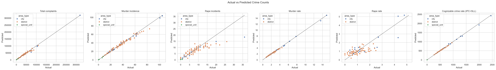
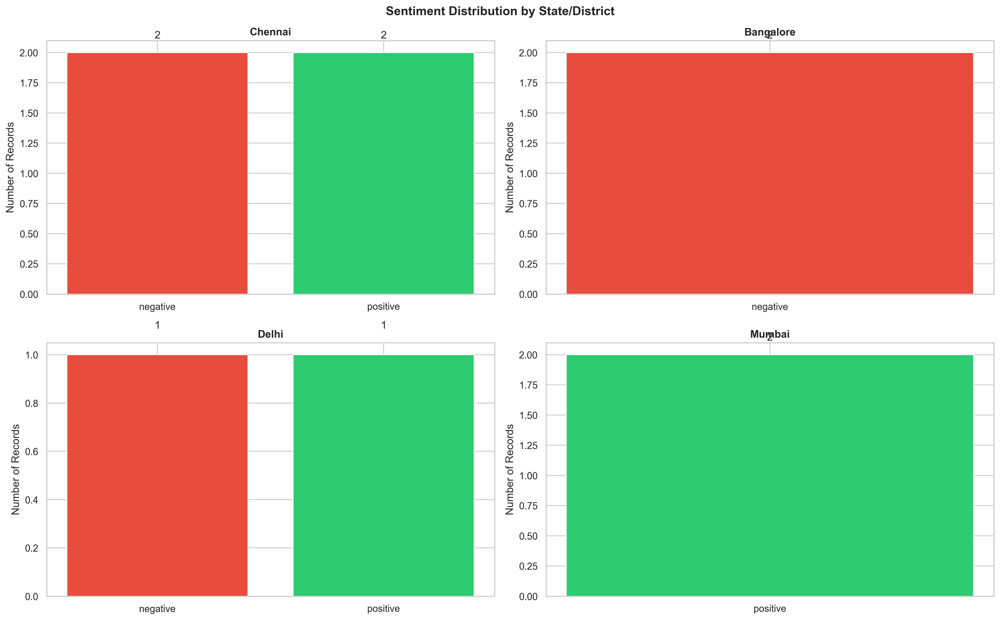

# PARTIAL PROJECT REPORT

## CRIMECAST: Crime Analysis, Prediction and Sentiment Analysis Using Machine Learning

**Submitted by:** [Student Name]  
**Register Number:** [Register Number]  
**Degree / Department:** [Degree and Department]  
**Institution:** [College / University Name]  
**Project Guide:** [Guide Name]  
**Academic Year:** [Academic Year]

---

## Declaration Note

This is a partial project report. It documents the problem definition, current system design, completed implementation, preliminary evaluation, and remaining work. Results may change when additional years, districts, and labeled text records are added.

---

## Table of Contents

1. Abstract
2. Introduction
3. Problem Statement
4. Objectives
5. Scope
6. Existing and Proposed Systems
7. Requirements
8. Dataset Description
9. Methodology
10. System Design
11. Module Description
12. Machine Learning and Sentiment Methods
13. Preliminary Results
14. Testing and Validation
15. Work Completed
16. Limitations and Ethical Considerations
17. Future Work
18. Conclusion
19. References

---

# 1. Abstract

CRIMECAST is a machine-learning project for cleaning, integrating, analysing, and modelling district-level crime statistics. The current implementation processes Tamil Nadu crime data for 2022 and 2023, including complaint totals, crimes against women, murder, homicide, negligence, and rate-related indicators. The raw files have different names and schemas, so the project automatically discovers supported files, standardises headers, removes aggregate rows, converts numeric values, combines multiple years, and produces a single machine-learning-ready table.

The system compares baseline regression, Ridge Regression, Random Forest Regression, and Gradient Boosting Regression. Separate models are selected for targets such as total complaints, murder incidence, murder rate, rape incidents, rape rate, and cognizable crime rate. The project also contains a sentiment-analysis module for complaint, news, and social-media text. It uses TF-IDF features with Logistic Regression when labeled text is available and a rule-based fallback otherwise. Outputs include cleaned datasets, saved models, predictions, metrics, charts, state/district sentiment summaries, and prototype forecasting reports.

The current integrated numeric dataset contains 99 records, 82 columns, 50 distinct district/city labels, and two years of observations. Preliminary model results are encouraging for total complaints and selected crime-rate targets, while rape-incident prediction requires more historical data. Sentiment results are preliminary because only ten labeled examples are currently available.

---

# 2. Introduction

Crime datasets are often published as separate tables containing counts, victims, rates, complaint channels, and administrative units. Direct analysis is difficult when files use inconsistent column names, spellings, district labels, missing-rate symbols, and aggregate total rows. Machine learning also requires a reproducible process that separates identifiers, handles missing values, avoids obvious target leakage, and evaluates models against a baseline.

CRIMECAST addresses these issues through an end-to-end workflow:

1. Discover raw CSV files and infer their year and category.
2. Clean and standardise each dataset.
3. Combine compatible years into one analysis table.
4. Generate features and preserve missing-value information.
5. Compare regression models using cross-validation and holdout testing.
6. Save the selected model for each prediction target.
7. Generate district-level predictions, charts, and reports.
8. Analyse labeled public-safety text using sentiment classification.

The system is intended as an academic decision-support prototype. It is not intended to replace official crime statistics or to make automated policing decisions.

---

# 3. Problem Statement

Existing crime data is distributed across multiple CSV tables and years. The files are not immediately suitable for machine learning because:

- Headers and district columns are inconsistent.
- Aggregate rows can cause double counting.
- Some rates are unavailable for special administrative units.
- Different years provide different levels of complaint detail.
- Numeric values, rates, and categorical fields need separate preprocessing.
- A single algorithm may not perform best for every crime target.
- Numeric crime tables do not contain public perception or sentiment.

The project therefore requires a system that can clean multi-year crime data, train and compare models, generate interpretable outputs, and separately analyse labeled text sentiment.

---

# 4. Objectives

## 4.1 Primary Objectives

- Create a reusable pipeline for cleaning crime CSV files.
- Integrate 2022 and 2023 district/city records.
- Analyse complaint, murder, rape, and crime-rate patterns.
- Compare multiple machine-learning algorithms.
- Save the best model for each prediction target.
- Produce charts and district-level prediction reports.
- Perform sentiment classification on complaint/news/social text.

## 4.2 Secondary Objectives

- Support automatic discovery of future year files.
- Preserve user-added text records during repeated cleaning runs.
- Generate state-wise and Tamil Nadu district-wise sentiment summaries.
- Provide a console application and reusable command-line utilities.
- Maintain metrics and artifacts for reproducibility.

---

# 5. Scope

The current scope covers structured Tamil Nadu crime statistics for 2022 and 2023. The system predicts numeric targets using other available feature families while excluding the target's own source family where required to reduce direct leakage. Sentiment analysis covers labeled English text and produces positive, negative, or low-confidence neutral outputs.

The project currently does not provide a production-grade future crime forecast. Two years are not enough to establish stable long-term trends, seasonality, or causal relationships. Prototype 2026 risk outputs are treated as experimental extensions and must not be interpreted as official forecasts.

---

# 6. Existing and Proposed Systems

## 6.1 Existing System

In a manual workflow, separate spreadsheets are opened, cleaned, and compared independently. This approach has several problems:

- Repeated manual cleaning is slow and error-prone.
- Schema differences make year-to-year comparison difficult.
- Aggregate rows may be included accidentally.
- Model selection is not systematic.
- Results are difficult to reproduce.
- Text sentiment and numeric crime statistics remain disconnected.

## 6.2 Proposed System

CRIMECAST provides an automated Python workflow. It produces a standard ML-ready table, evaluates several algorithms, stores selected models, generates charts, and creates sentiment summaries. The same command can regenerate outputs when new supported year files are placed in the dataset folder.

## 6.3 Advantages

- Reproducible data preparation
- Automatic multi-year discovery
- Multiple model comparison
- Separate evaluation for each target
- Saved model artifacts
- District/city prediction utilities
- Visual and textual reports
- Extensible sentiment-analysis workflow

---

# 7. Requirements

## 7.1 Hardware Requirements

| Component | Minimum | Recommended |
|---|---|---|
| Processor | Dual-core 64-bit CPU | Intel i5 / Ryzen 5 or better |
| Memory | 4 GB RAM | 8 GB RAM or more |
| Storage | 1 GB free space | 5 GB free space |
| Display | 1366 x 768 | Full HD |

## 7.2 Software Requirements

| Software | Purpose |
|---|---|
| Windows 10/11 | Development environment |
| Python 3.11 | Core implementation |
| VS Code / Jupyter | Development and analysis |
| pandas and NumPy | Data preparation |
| scikit-learn | ML preprocessing, training, evaluation |
| matplotlib and seaborn | Visualisation |
| joblib | Model persistence |
| TextBlob (optional) | Compatibility/fallback text support |

---

# 8. Dataset Description

## 8.1 Current Structured Dataset

| Property | Current Value |
|---|---:|
| Years | 2022, 2023 |
| Integrated rows | 99 |
| Integrated columns | 82 |
| Distinct district/city labels | 50 |
| Main categories | Complaints, crimes against women, murder/homicide/negligence |
| ML-ready file | `dataset/cleaned/crimecast_ml_ready.csv` |

The 2022 files contain 49 usable rows after removing an aggregate total row. The 2023 files contain 50 usable rows. Some special administrative units have incident counts but no population-based rate, so their rates remain missing and are imputed inside the model pipeline rather than replaced during raw cleaning.

## 8.2 Text Dataset

The current sentiment dataset contains ten labeled English records:

| Label | Records |
|---|---:|
| Positive | 5 |
| Negative | 5 |
| Neutral | 0 |

This text sample is sufficient to demonstrate the supervised pipeline but is not sufficient for a reliable final sentiment model. More balanced records, especially neutral examples, are required.

## 8.3 Main Cleaning Operations

- Standardise headers to snake_case.
- Correct known spelling/header variations.
- Standardise district/city identifiers.
- Remove total/aggregate rows.
- Remove source serial-number fields.
- Convert numeric-looking values to numeric data types.
- Preserve unavailable rates as missing values.
- Add year and area-type fields.
- Merge dataset families by year, district/city, and area type.

---

# 9. Methodology

## 9.1 Numeric Crime Prediction

1. Read supported CSV files from the dataset directory.
2. Infer year and dataset category from the filename.
3. Standardise fields and validate district identifiers.
4. Concatenate multiple years within each dataset category.
5. Outer-join categories using year, district/city, and area type.
6. Derive ratio features where numerator and denominator are available.
7. Select features while excluding identifiers and target-family leakage fields.
8. Impute missing numeric values using the median.
9. One-hot encode categorical variables.
10. Compare baseline, Ridge, Random Forest, and Gradient Boosting models.
11. Evaluate using shuffled cross-validation and a 20 percent holdout test set.
12. Train the selected model on all available rows and save it using joblib.

## 9.2 Sentiment Analysis

1. Read text, source, location, and optional sentiment labels.
2. Remove URLs, mentions, and repeated whitespace.
3. Validate labels as positive, negative, or neutral.
4. Convert text into unigram and bigram TF-IDF features.
5. Train class-balanced Logistic Regression.
6. Evaluate with stratified cross-validation.
7. Convert low-confidence binary predictions to neutral.
8. Compute compatible polarity, subjectivity, confidence, and crime-keyword fields.
9. Generate state/district summary reports and figures.

---

# 10. System Design

## 10.1 System Flow Diagram (SFD)

The SFD shows the operational sequence for both numeric crime prediction and sentiment analysis. Structured crime data moves through discovery, cleaning, integration, feature engineering, model comparison, evaluation, and reporting. Text records follow a separate supervised sentiment path before being aggregated by location.


## 10.2 Data Flow Diagram - Level 0

The Level 0 DFD represents CRIMECAST as a single process. Crime-data sources and text-data sources provide raw input. The user or analyst submits an analysis request and receives predictions, charts, and reports.


## 10.3 Data Flow Diagram - Level 1

The Level 1 DFD decomposes CRIMECAST into ingestion, cleaning/integration, model training, prediction/visualisation, and sentiment-analysis processes.


### DFD Process Description

| Process | Description |
|---|---|
| 1.0 Ingest Data | Discovers and reads raw CSV files and text records. |
| 2.0 Clean and Integrate | Standardises fields, removes aggregates, and combines years. |
| 3.0 Train and Evaluate ML | Preprocesses features, compares models, and records metrics. |
| 4.0 Predict and Visualise | Loads models, produces predictions, and generates figures. |
| 5.0 Analyse Sentiment | Trains/loads the text classifier and generates location summaries. |

### DFD Data Stores

| Store | Contents |
|---|---|
| D1 Raw Data | Original crime CSV files and source text records |
| D2 Cleaned Data | Per-year cleaned files and combined ML-ready dataset |
| D3 Model Store | Saved joblib regression and sentiment models |
| D4 Results | Metrics, predictions, figures, CSV summaries, and text reports |

---

# 11. Module Description

| Module | Responsibility |
|---|---|
| `clean_data.py` | File discovery, cleaning, schema alignment, multi-year merge |
| `train_model.py` | Feature preprocessing, model comparison, evaluation, persistence |
| `predict.py` | Area/year target prediction using saved models |
| `visualize.py` | Crime and actual-versus-predicted charts |
| `sentiment_analysis.py` | TF-IDF sentiment training, scoring, metrics, compatibility fields |
| `sentiment_by_state.py` | State/district sentiment aggregation and reports |
| `sentiment_tn_districts.py` | Tamil Nadu district-specific sentiment summaries |
| `app.py` | Interactive and command-line project interface |
| `dashboard.py` | Dashboard-oriented presentation layer |
| `predict_2026_rape_all_districts.py` | Experimental district-level 2026 rape prediction extension |
| `test_project.py` | Dependency, import, data, and sentiment health checks |

---

# 12. Machine Learning and Sentiment Methods

## 12.1 Candidate Regression Algorithms

### Dummy Regressor

The median-value baseline measures whether trained models provide improvement over a simple constant prediction.

### Ridge Regression

Ridge Regression is a regularised linear model. It is useful as an interpretable baseline and reduces the effect of correlated features.

### Random Forest Regression

Random Forest combines many decision trees. It handles nonlinear relationships, interactions, mixed feature scales, and noisy tabular data. In the current project it performs best for rape-incident prediction.

### Gradient Boosting Regression

Gradient Boosting builds trees sequentially to correct previous errors. It currently provides the strongest test performance for most targets, including total complaints and crime-rate targets.

## 12.2 Sentiment Classifier

The sentiment model uses TF-IDF unigram/bigram features and class-balanced Logistic Regression. The model provides class probabilities, while the project converts low-confidence binary predictions to neutral. A negation-aware crime-domain rule scorer remains available when a trained model is unavailable.

---

# 13. Preliminary Results

## 13.1 Regression Results

| Target | Selected Model | Test MAE | Test RMSE | Test R2 |
|---|---|---:|---:|---:|
| Cognizable crime rate (IPC+SLL) | Gradient Boosting | 98.301 | 130.016 | 0.710 |
| Total complaints | Gradient Boosting | 3130.381 | 5011.149 | 0.942 |
| Murder incidence | Gradient Boosting | 8.390 | 10.630 | 0.656 |
| Murder rate | Gradient Boosting | 0.763 | 1.457 | 0.764 |
| Rape rate | Gradient Boosting | 0.486 | 0.662 | 0.579 |
| Rape incidents | Random Forest | 3.373 | 4.946 | 0.341 |

The total-complaints model currently has the strongest holdout R2. Rape-incident prediction is the weakest target and needs more years and stronger contextual features. These figures are preliminary because 99 observations remain a small tabular dataset.



## 13.2 Sentiment Results

| Metric | Result |
|---|---:|
| Labeled rows | 10 |
| Cross-validation folds | 5 |
| Accuracy | 0.900 |
| Macro F1 | 0.899 |

The preliminary result is promising but must be interpreted carefully. Ten records are too few for a stable estimate, and the current training labels contain no neutral examples. The uncertainty threshold improves mixed-text behavior but does not replace real neutral training data.



---

# 14. Testing and Validation

The project currently includes the following checks:

- Python compilation checks for core modules.
- CSV shape, year, and target-coverage checks.
- Duplicate and aggregate-row validation.
- Model artifact reload and sample-prediction tests.
- Cross-validation and holdout regression metrics.
- Stratified sentiment cross-validation.
- Positive, negative, and mixed-text scoring tests.
- State and Tamil Nadu district report integration tests.
- Output-directory and required-file checks.

Saved model artifacts are loaded after training and tested on sample records to ensure that preprocessing and model state are serialised together.

---

# 15. Work Completed

| Work Item | Status |
|---|---|
| Raw crime-data collection for 2022 and 2023 | Completed |
| Automatic file/year discovery | Completed |
| Cleaning and standardisation | Completed |
| Multi-year integration | Completed |
| EDA and chart generation | Completed |
| Regression model comparison | Completed |
| Saved model and prediction utility | Completed |
| Console application | Completed |
| Supervised sentiment prototype | Completed |
| State/district sentiment reports | Completed |
| 2026 district forecasting extension | Prototype |
| Larger neutral-inclusive sentiment dataset | Pending |
| Three or more consistent crime years | Pending |
| Final dashboard/report refinement | In progress |

---

# 16. Limitations and Ethical Considerations

## 16.1 Technical Limitations

- Only two complete structured years are available.
- Different years contain different complaint detail.
- Some special units do not have population-based rates.
- District labels represent administrative units, not exact geographic coordinates.
- Rape-incident prediction has low explanatory performance.
- Sentiment evaluation is based on only ten labeled examples.
- Random holdout evaluation does not simulate a strict future-year forecast.

## 16.2 Ethical Considerations

- Predictions should not be used to label individuals or communities as criminal.
- Historical crime data may reflect reporting and enforcement bias.
- Low incident counts may still represent serious harm.
- Sentiment text should be anonymised and collected with appropriate permission.
- Model outputs must be presented with uncertainty and validation limits.
- Official statistics remain the authoritative source for public decisions.

---

# 17. Future Work

1. Add consistent data for 2019-2021 and later years.
2. Create lag features, rolling averages, and year-over-year change features.
3. Use time-based validation, such as training on earlier years and testing on the latest year.
4. Add population, demographic, socioeconomic, and geographic features.
5. Collect at least 100 balanced sentiment records including neutral examples.
6. Evaluate advanced text models after the labeled dataset is large enough.
7. Add prediction intervals and uncertainty bands.
8. Improve dashboard filtering by year, district, target, and risk category.
9. Add automated unit and data-quality tests.
10. Compare model outputs with official future-year data when it becomes available.

---

# 18. Conclusion

The partial implementation demonstrates a complete reproducible workflow from raw crime CSV files to cleaned multi-year data, trained models, predictions, charts, and sentiment reports. The cleaner successfully integrates differing 2022 and 2023 schemas. Model comparison shows that Gradient Boosting performs strongly for most current targets, while Random Forest is selected for rape incidents. Sentiment analysis has been upgraded from a simple word counter to a supervised TF-IDF and Logistic Regression pipeline with compatibility support for state and Tamil Nadu district reporting.

The project is functionally suitable for an academic prototype, but the current data volume limits claims about future crime forecasting. The next phase should prioritise additional consistent years, time-based validation, balanced sentiment labels, and careful uncertainty reporting.

---

# 19. References

1. Scikit-learn documentation, machine learning in Python: https://scikit-learn.org/
2. pandas documentation, Python data analysis library: https://pandas.pydata.org/docs/
3. NumPy documentation: https://numpy.org/doc/
4. Matplotlib documentation: https://matplotlib.org/stable/
5. seaborn documentation: https://seaborn.pydata.org/
6. Source crime-statistics CSV files supplied to the project. The original government publication/agency should be added here in the final report.

---

## Appendix A: Main Commands

```powershell
# Full clean, train, and visualisation pipeline
.\.venv\Scripts\python.exe main.py

# Interactive application
.\.venv\Scripts\python.exe app.py

# Train regression models
.\.venv\Scripts\python.exe train_model.py

# Run sentiment analysis
.\.venv\Scripts\python.exe app.py --sentiment

# Predict for one area/year/target
.\.venv\Scripts\python.exe predict.py --area Chennai --year 2023 --target murder
```

## Appendix B: Main Output Locations

- Cleaned datasets: `dataset/cleaned/`
- Saved models: `models/`
- Metrics and predictions: `model_outputs/`
- Figures: `model_outputs/figures/`
- Partial report figures: `reports/diagrams/`

