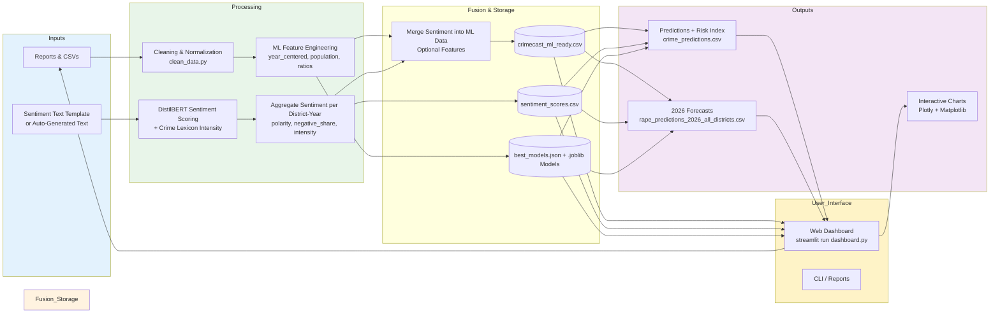

# CRIMECAST - Data Flow Diagram

## Data Flow Explanation
1. **Raw Inputs**: Three categories of TN crime statistics + optional free-text for sentiment.
2. **Cleaning**: Standardize names, handle missing values, add derived columns (year, area_type).
3. **Sentiment Path**: Text → DistilBERT (or fallback) → polarity, confidence, crime_intensity, keywords.
4. **Fusion**: Sentiment aggregates are joined to the numeric ML table as predictive features.
5. **Model Storage**: Trained pipelines saved with feature metadata.
6. **Main Consumption**: The **Web Dashboard** now acts as the primary interface, pulling from DB1, DB2, and DB3 to deliver live predictions, sentiment scoring, and 2026 forecasts.
7. **Outputs**: Interactive visualizations (via dashboard), CSVs, and generated reports.

**Key Innovation**: Sentiment is actively fused into ML features. The dashboard provides the main interactive layer for end users.

**How to Render**: Paste Mermaid into mermaid.live or compatible viewer.
