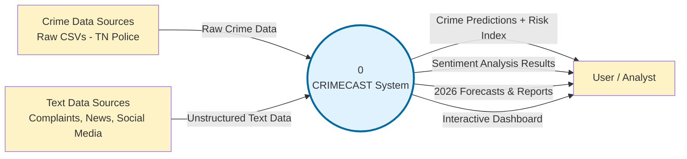

# CRIMECAST - Level 0 DFD (Context Diagram)

## Description

**Process 0: CRIMECAST System**
- The entire system represented as one single process.
- Receives raw crime data and text data.
- Produces predictions, risk scores, forecasts, reports, and the interactive dashboard.

**External Entities:**
- **Crime Data Sources**: Tamil Nadu Police / NCRB raw data (2022-2023).
- **User / Analyst**: The person who uses the system for analysis and forecasting.
- **Text Data Sources**: Provider of narrative text (complaints, news, social media) for sentiment analysis.

**Rules Applied:**
- Only **one process** (numbered 0).
- No data stores shown at Level 0.
- All inputs and outputs must balance with Level 1.
- This diagram defines the scope of the system.
