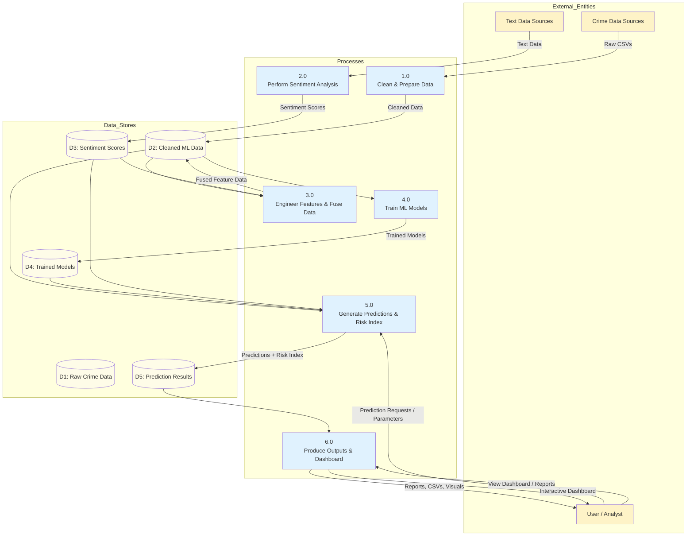

# CRIMECAST - Level 1 DFD

## Level 1 Processes

| Process | Description |
|---------|-------------|
| **1.0 Clean & Prepare Data** | Ingest raw CSVs, standardize columns, remove aggregate rows, convert types, add year/area_type. |
| **2.0 Perform Sentiment Analysis** | Score text using DistilBERT (primary) + rule-based fallback. Extract polarity, confidence, crime intensity and keywords. |
| **3.0 Engineer Features & Fuse Data** | Add time-based features (year_centered, is_latest_year) and merge sentiment aggregates into numeric data. |
| **4.0 Train ML Models** | Train multiple models with temporal validation (past year → latest year). Save best models for each target (including rates). |
| **5.0 Generate Predictions & Risk Index** | Use latest data + trained models to predict for selected area/year. Calculate blended Risk Index (prediction volume + negative sentiment). |
| **6.0 Produce Outputs & Dashboard** | Generate CSVs, reports, visualizations. Power the Streamlit interactive dashboard for user interaction. |

## Data Stores

- **D1**: Raw Crime Data (original source files)
- **D2**: Cleaned & Engineered Data (`crimecast_ml_ready.csv`)
- **D3**: Sentiment Scores (`sentiment_scores.csv`)
- **D4**: Trained Models (`.joblib` + metadata)
- **D5**: Prediction Results (including 2026 forecasts and risk scores)

## Balancing Note
All external flows from Level 0 (Raw Crime Data, Text Data, Predictions/Risk, etc.) are preserved and decomposed in Level 1. The User now explicitly sends requests to trigger predictions and dashboard views.
