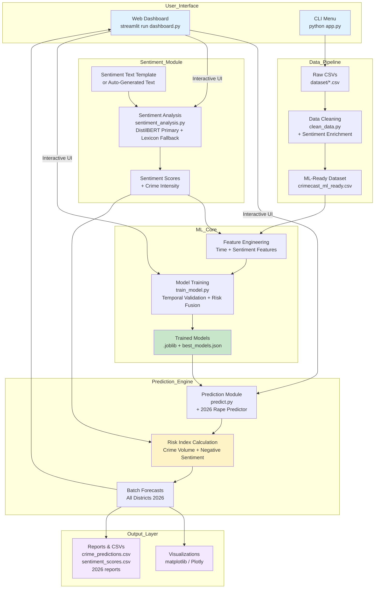

# CRIMECAST - System Flow Diagram

## Description
- **Primary Entry Point**: **Web Dashboard** (`dashboard.py`) — modern interactive interface (light theme).
- **Alternative**: **CLI Menu** (`app.py`) for script-based or full pipeline usage.
- **Core Flow**: Raw data → Cleaning + Sentiment Enrichment → ML Training with Risk Fusion.
- **Prediction Engine**: Generates predictions + blended Risk Index (prediction volume + negative sentiment).
- **Outputs**: Interactive views in dashboard, plus CSVs, reports and visualizations.

**Key Points**:
- The Streamlit dashboard is the main way users interact with the system.
- Sentiment analysis (DistilBERT) feeds into both standalone scoring and ML feature engineering.
- All diagrams maintain consistency with Level 0/1 DFDs.

**How to Render**: Copy the Mermaid code into https://mermaid.live , VS Code Mermaid extension, or export as image for your report.
